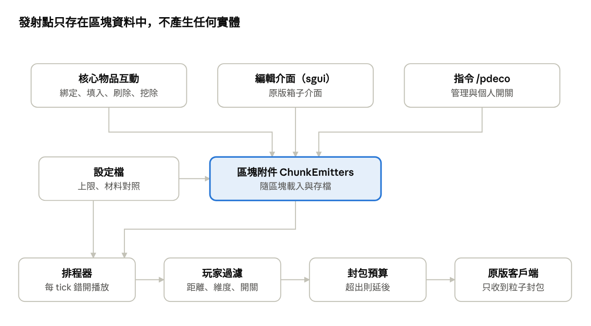

# 粒子裝飾伺服端模組 開發規格書

Oct 4, 2026 · @yoyolee

## 1. 專案概述

本模組讓玩家在生存模式中，以原版物品為材料，在建築上放置持續播放的粒子效果，整個功能只需安裝在伺服器端，原版客戶端可直接加入。

**暫定名稱**：Particle Deco（mod id：particledeco）

**目標版本**：Minecraft Java 26.2 以上，Fabric Loader + Fabric API。26.2 已於 2026 年 6 月正式發布，Fabric API 也已有 26.2 與 26.3 的版本（[Fabric API 26.2](https://modrinth.com/mod/fabric-api/version/0.152.2+26.2)、[CurseForge 檔案頁](https://www.curseforge.com/minecraft/mc-mods/fabric-api/files/8301805)）。

### 目標

- 原版客戶端零安裝即可看到效果，也能完成放置、編輯、刪除等所有操作。

- 保持原味：取得與使用方式走生存路線，需要消耗原版材料，粒子類型與物品有直覺對應（例如烈焰粉對應火焰）。

- 對伺服器效能與網路頻寬的影響可控，並由管理員設定上限。

- 單人遊戲（整合伺服器）同樣可用。

### 非目標

- 不新增自訂方塊、自訂物品材質或資源包。

- 不做客戶端渲染優化，也不提供客戶端設定介面。

- 第一版不做粒子動畫編輯器或任意腳本。

## 2. 設計決策：綁定方塊

**結論**：發射點綁定在方塊上，資料存在區塊附件，伺服器上沒有任何實體。玩家用粒子核心綁定方塊，放入原版物品決定粒子，用刷子清除粒子，挖掉方塊即解除綁定。

### 選擇理由

- 沒有伺服器實體，數百個發射點的成本只剩排程與封包，且只在區塊載入時運作。

- 綁定方塊讓位置天生對齊建築，方塊消失時效果一起消失，不會留下孤兒資料。

- 保留原構想的精神：粒子種類由放入的原版物品決定。

- 細部位置用 1/16 格偏移在模組內調整，不必依賴盔甲架調整模組。

### 已確定的決策

| 項目 | 決定 |
|----|----|
| 錨點 | 綁定方塊，一個方塊最多一個發射點 |
| 方塊消失偵測 | 播放前檢查方塊種類，涵蓋爆炸、活塞、火燒、流水、終界使者 |
| 框線顯示 | 對特定玩家送出假的發光 block_display 封包，伺服器不產生實體 |
| 材料右鍵 | 攔截原版的放置與方塊互動 |
| 清除粒子的工具 | 刷子 |
| 擁有者 | 不記錄、不檢查，私人伺服器用途 |
| 解除綁定 | 挖掉方塊 |
| 粒子核心 | 綁定時消耗，解除時不歸還；紫水晶碎片可從紫水晶母岩持續再生，適合當消耗品 |

### 清除工具：刷子

- 刷子在原版只對可疑的沙子與可疑的礫石有作用，與一般建築方塊幾乎沒有衝突。剪刀則會和南瓜雕刻、蜂巢採集、絆線解除、藤蔓修剪搶操作。

- 「刷掉粒子」的語意直覺，玩家一看就懂。

- 生存初期就能合成（羽毛、銅錠、木棒），符合原味門檻。

- 例外規則：可疑的沙子與可疑的礫石不可被綁定，避免與考古機制衝突。

## 3. 玩家操作流程與指令

玩家只需要粒子核心、原版材料與刷子，全部操作用右鍵與挖掘完成，日常使用不需要任何指令。

### 取得粒子核心

預設做法：在鐵砧把**紫水晶碎片**命名為「粒子核心」（名稱與底材可在設定檔修改）。模組辨識的依據是原版 minecraft:custom_data 元件裡的 particledeco_core: 1b 標記，命名只是觸發轉換的方式：伺服器偵測到符合名稱的物品從鐵砧取出時，寫入該標記並設定 minecraft:enchantment_glint_override 加上光澤。這樣玩家改名也不會失效，同名物品也不會被誤判。注意：**不可註冊自訂資料元件**，原版客戶端收到未知元件會斷線。

選配做法：管理員可在設定檔改為合成配方（伺服器端資料包配方，原版客戶端可正常顯示）。

### 方塊狀態

| 狀態     | 畫面     | 進入方式                         | 挖掉時掉落            |
|----------|----------|----------------------------------|-----------------------|
| 一般方塊 | 無       | 預設                             | 原版掉落              |
| 等待填入 | 發光框線 | 手持核心右鍵一般方塊             | 方塊本身              |
| 播放中   | 粒子     | 拿對照表內物品右鍵等待填入的方塊 | 方塊本身 + 存入的物品 |

刷子右鍵播放中的方塊會回到等待填入，存入的物品掉落。挖掉方塊會從任何狀態直接回到一般方塊。

### 操作細節

1.  **綁定**：手持核心右鍵一般方塊，消耗 1 個核心，進入等待填入。對已綁定的方塊用核心右鍵則開啟編輯介面。

2.  **框線**：等待填入的方塊一律顯示框線；播放中的方塊只在玩家手持核心或刷子時顯示框線，方便找到並編輯。框線只送給符合條件的玩家，切換手持物品時即時新增或移除。等待填入用黃色、播放中用青色。

3.  **填入**：拿材料對照表內的物品右鍵等待填入的方塊，扣 1 個物品存入發射點並開始播放。此時攔截原版的放置與方塊互動（例如拿營火不會放下營火，對箱子不會開啟箱子）。手上不是對照表物品時照原版行為。

4.  **調整**：核心右鍵已綁定的方塊開啟介面，調整形狀、偏移、數量、間隔、紅石模式與染料顏色。

5.  **刷除**：刷子右鍵播放中的方塊，停止粒子，存入的物品掉落在玩家面前，回到等待填入。刷子對等待填入的方塊沒有作用，對一般方塊維持原版行為。刷子耐久消耗由設定檔決定，預設不消耗。

6.  **解除**：挖掉方塊。方塊本身沿用原版戰利品表（需要絲綢之觸的方塊照原版規則），模組只額外掉落存入的物品，避免重複掉落。創造模式不額外掉落。核心不歸還。

7.  **非玩家造成的消失**：排程器播放前檢查該座標的方塊種類，與綁定時不同就解除，存入的物品掉落在原座標。只比對方塊種類，不比對方塊狀態，因此門開關、熔爐點燃、作物成長都不會誤判，發射點的狀態與粒子設定也維持不變。

### 不可綁定的方塊

- 空氣、流體、可疑的沙子、可疑的礫石。

- 設定檔可再加入黑名單。

### 指令

| 指令 | 權限 | 說明 |
|----|----|----|
| /pdeco toggle | 所有人 | 個人開關，關閉後不再收到裝飾粒子，給低配電腦的玩家 |
| /pdeco near \[radius\] | 所有人 | 列出附近發射點的座標、狀態與粒子 |
| /pdeco remove \<x y z\> | OP 2 | 解除指定方塊的綁定，存入物品掉落 |
| /pdeco purge \<radius\> | OP 2 | 批次解除 |
| /pdeco give core \[player\] | OP 2 | 直接給予核心 |
| /pdeco reload | OP 2 | 重新載入設定檔與對照表 |
| /pdeco stats | OP 2 | 顯示發射點數量、每 tick 封包數、耗時 |

## 4. 系統架構與資料模型

三種玩家輸入都只修改區塊附件中的資料；播放端每 tick 讀取資料，經過玩家過濾與封包預算後才送出原版粒子封包。

模組架構 · 輸入、資料、播放三層

設定檔同時提供互動端的材料對照與播放端的上限，客戶端從頭到尾只看到原版封包。

### Emitter 資料欄位

| 欄位         | 型別           | 說明                                   |
|--------------|----------------|----------------------------------------|
| pos          | BlockPos       | 綁定的方塊座標，也是資料的鍵           |
| block        | 方塊 id        | 綁定時的方塊種類，用於消失偵測         |
| material     | ItemStack      | 存入的物品；空值代表等待填入           |
| particle     | 粒子 id + 選項 | 由材料推得，例如 minecraft:dust 加顏色 |
| offset       | 3 個 int       | 以 1/16 格為單位，每軸 -32 到 32       |
| shape        | enum           | point、column、ring、area              |
| shapeSize    | float          | 高度、半徑或邊長                       |
| count        | int            | 每次數量                               |
| interval     | int            | 播放間隔 tick                          |
| spread       | float          | 隨機擴散                               |
| redstoneMode | enum           | IGNORE、ON_SIGNAL、NO_SIGNAL           |
| dataVersion  | int            | 資料版本，用於日後遷移                 |

不記錄擁有者。播放錯開的 tick 以 pos 雜湊計算。

### 儲存方式

- **發射點**：Fabric Data Attachment API 的區塊附件 particledeco:emitters，以 Codec 持久化，**不同步到客戶端**（同步需要客戶端模組）。區塊載入時登錄到記憶體中的活躍清單，卸載時移除。

- **個人開關**：主世界的 SavedData 保存關閉粒子的玩家 UUID 清單。

- **框線可見狀態**：只存在記憶體，記錄每位玩家目前看到哪些假實體，不持久化。

- 若 26.2 的附件 API 不適合，退回方案是每個維度一份 SavedData，以 ChunkPos 為鍵分組，播放時只處理已載入的區塊。

## 5. 粒子效果定義與設定檔格式

粒子種類由「材料物品對照表」決定，形狀與參數由介面調整；兩者都以 JSON 設定，/pdeco reload 即時生效。只能使用原版 ParticleTypes，原版客戶端才能渲染。

### 預設材料對照

選材原則：材料可再生、與粒子在原版中的來源有關；越特別的粒子用越難取得的材料。粒子清單依據 [中文 Minecraft Wiki：Java版粒子](https://zh.minecraft.wiki/w/Java%E7%89%88%E7%B2%92%E5%AD%90)。

| 稀有度 | 材料 | 粒子 | 關聯與備註 |
|----|----|----|----|
| 常見 | 火把 | flame | 火把的火焰 |
| 常見 | 蠟燭 | small_flame | 點燃蠟燭的小火苗 |
| 常見 | 銅火把 | copper_fire_flame | 銅火把的綠色火焰 |
| 常見 | 營火 | campfire_cosy_smoke | 營火炊煙 |
| 常見 | 乾草捆 | campfire_signal_smoke | 營火放在乾草捆上的高聳狼煙 |
| 常見 | 木炭 | smoke | 小黑煙 |
| 常見 | 煤炭 | large_smoke | 大黑煙 |
| 常見 | 水桶 | dripping_water | 滴水，整桶存入，刷除時原樣掉落 |
| 常見 | 鐘乳石 | dripping_dripstone_water | 鐘乳石滴水 |
| 常見 | 蜂蜜瓶 | dripping_honey | 蜂巢滴蜜 |
| 常見 | 骨粉 | happy_villager | 施骨粉時的綠色星點 |
| 常見 | 小麥 | heart | 餵食繁殖的愛心 |
| 常見 | 音符盒 | note | 音符 |
| 常見 | 書架 | enchant | 書架流向附魔台的符文 |
| 常見 | 任一小型花 | falling_nectar | 蜜蜂掉落的花粉 |
| 常見 | 雪球 | item_snowball | 雪球碎屑 |
| 常見 | 墨囊 | squid_ink | 墨汁 |
| 常見 | 紅石粉 | dust | 紅石粒子，第二格放染料改顏色 |
| 常見 | 任一混凝土粉末 | falling_dust | 懸空沙土的落塵，顏色取自該粉末 |
| 常見 | 蜂巢 | wax_on | 上蠟時的光點 |
| 常見 | 煙火 | firework | 煙火火花尾跡 |
| 中等 | 靈魂火把 | soul_fire_flame | 藍色靈魂火焰 |
| 中等 | 熔岩桶 | dripping_lava | 滴熔岩，整桶存入，刷除時原樣掉落 |
| 中等 | 岩漿球 | lava | 熔岩迸出的火星 |
| 中等 | 櫻花樹葉 | cherry_leaves | 櫻花花瓣飄落 |
| 中等 | 蒼白橡木樹葉 | pale_oak_leaves | 蒼白落葉 |
| 中等 | 緋紅蕈菇 | crimson_spore | 緋紅森林的孢子 |
| 中等 | 扭曲蕈菇 | warped_spore | 扭曲森林的孢子 |
| 中等 | 靈魂沙 | ash | 靈魂沙谷的灰燼 |
| 中等 | 玄武岩 | white_ash | 玄武岩三角洲的白灰 |
| 中等 | 菌絲土 | mycelium | 菌絲土的孢子 |
| 中等 | 粉雪桶 | snowflake | 雪花，整桶存入，刷除時原樣掉落 |
| 中等 | 螢光墨囊 | glow | 螢光烏賊的光點 |
| 中等 | 孢子花 | spore_blossom_air | 漂浮孢子，可向流浪商人購買 |
| 中等 | 螢火蟲灌木叢 | firefly | 螢火蟲，可用骨粉繁殖灌木叢 |
| 中等 | 避雷針 | electric_spark | 雷擊銅時的電火花 |
| 中等 | 終界珍珠 | portal | 傳送門的紫色粒子 |
| 中等 | 哭泣的黑曜石 | dripping_obsidian_tear | 紫色淚滴，可向豬布林以物易物 |
| 中等 | 任一藥水 | entity_effect | 狀態效果漩渦，顏色取自藥水 |
| 中等 | 風彈 | small_gust | 小型旋風 |
| 中等 | 鸚鵡螺殼 | nautilus | 海靈核心的漩渦粒子 |
| 中等 | 伏聆振測器 | dust_color_transition | 振測器啟動時的變色粒子，伏聆觸媒擴散可再生 |
| 中等 | TNT | explosion | 爆炸煙團，建議間隔 40 tick 以上 |
| 中等 | 岩漿塊 | geyser_base | 間歇泉底部持續冒出的蒸氣；原版間歇泉需要烈性硫磺下方墊岩漿塊 |
| 中等 | 硫磺尖錐 | geyser_poof | 間歇泉底部快速爆發的蒸氣；尖錐會自然生長，可再生 |
| 中等 | 硫磺 | noxious_gas | 硫磺池水面的黃色煙霧；可用硫磺尖錐合成，尖錐會自然生長，可再生 |
| 稀有 | 終界燭 | end_rod | 白色光點，材料需前往終界 |
| 稀有 | 重生錨 | reverse_portal | 重生錨的反向傳送門粒子 |
| 稀有 | 試煉鑰匙 | vault_connection | 接近寶庫時的連線光點 |
| 稀有 | 不祥試煉鑰匙 | trial_spawner_detection_ominous | 不祥試煉生怪磚的藍色火花 |
| 稀有 | 不祥之瓶 | ominous_spawning | 不祥物品生成時的粒子 |
| 稀有 | 伏聆觸媒 | sculk_soul | 生物死亡時觸媒吸收的靈魂，伏守者掉落 |
| 稀有 | 龍息 | dragon_breath | 紫色龍息，重生終界龍可再取得 |
| 稀有 | 不死圖騰 | totem_of_undying | 圖騰發動時的光點，喚魔者掉落 |
| 稀有 | 烈性硫磺 | geyser_plume | 間歇泉噴發的上升蒸氣柱，搭配 column 形狀；需 9 個硫磺合成 |

**帶選項的粒子**：dust 的顏色由第二格染料決定，預設紅色；falling_dust 的方塊取自放入的混凝土粉末；entity_effect 的顏色取自藥水內容；dust_color_transition 預設使用伏聆振測器的配色。

**刻意不收錄**：只在水中存在的粒子（bubble、bubble_column_up、current_down）離開水會立即消失；會遮擋畫面或干擾玩家的粒子（elder_guardian、sonic_boom、flash、explosion_emitter）。

**不直接使用的 26.2 粒子**：geyser 與 noxious_gas_cloud 是粒子發射器，模組改為直接播放它們產生的 geyser_base、geyser_poof、geyser_plume、noxious_gas，才能分別控制；sulfur_bubbles 只在水中上升，不收錄。

**待補**：26.3 的楊樹落葉（red_poplar_leaves 等三種）在支援 26.3 後加入。

### 形狀

- point：單點，可設擴散範圍。

- column：垂直柱，高度 1 到 4 格。

- ring：水平圓環，半徑 0.25 到 3 格。

- area：方形區域隨機落點，邊長 1 到 5 格，適合雨、花瓣。

- spiral：螺旋上升，第二階段再做。

### 參數範圍

| 參數         | 範圍                           | 預設 |
|--------------|--------------------------------|------|
| 間隔（tick） | 2 到 100                       | 10   |
| 每次數量     | 1 到 伺服器上限（預設 8）      | 2    |
| 偏移         | 每軸 ±2 格，步進 1/16          | 0    |
| 紅石模式     | 無視 / 有訊號才播 / 無訊號才播 | 無視 |

### 設定檔位置

- config/particledeco/config.json：全域上限、核心物品、是否消耗材料、顯示距離。

- config/particledeco/materials.json：材料對照表。

{\
"core": { "item": "minecraft:amethyst_shard", "anvilName": "粒子核心", "recipeMode": false },\
"brushDurabilityCost": 0,\
"bindBlacklist": \["minecraft:suspicious_sand", "minecraft:suspicious_gravel"\],\
"outline": { "waitingColor": "#FFD54A", "playingColor": "#4AD9FF", "showDistance": 16 },\
"viewDistance": 32,\
"limits": {\
"perChunk": 32,\
"maxCountPerEmit": 8,\
"globalPacketsPerTick": 400,\
"perPlayerPacketsPerTick": 60\
}\
}

## 6. 效能、權限、安全與相容性

最大的風險在網路頻寬：每個發射點每次播放都是一個封包，乘上附近玩家數。因此限制以「封包數」計算，CPU 成本反而很小。

### 效能規則

- 只處理已載入區塊中的發射點，區塊卸載即停止。

- 每個發射點以自身 id 雜湊錯開播放 tick，避免同一 tick 爆量。

- 送出前先過濾玩家：同維度、距離在 viewDistance 內、未關閉個人開關。

- 每 tick 有全域與每位玩家的封包預算，超出時延後到下一 tick，並在 /pdeco stats 記錄。

- 形狀粒子（ring、column）在伺服器計算座標，一次播放可能需要多個封包，計入預算。

- 使用 ServerLevel.sendParticles(ServerPlayer, ...) 這類可指定玩家的多載，force（長距離）一律為 false。

### 權限

- 私人伺服器用途：不記錄也不檢查擁有者，所有玩家都能綁定、填入、刷除與解除任何方塊。

- 管理指令以原版 OP 等級 2 判斷，不需要 fabric-permissions-api，也不整合領地保護模組。

### 框線假實體

- 對特定玩家送出 ClientboundAddEntityPacket 加 ClientboundSetEntityDataPacket，建立一個 block_display：顯示該方塊本身的方塊狀態，縮放 1.002 倍並置中，避免與真實方塊重疊閃爍；開啟 Glowing 旗標，以發光顏色覆寫欄位設定黃色或青色。

- 伺服器世界中不存在這個實體，沒有 tick 成本，原版客戶端照常渲染發光輪廓。

- 實體 id 從保留區段配發（例如從 Integer.MAX_VALUE 往下遞減），UUID 隨機產生，避免與真實實體衝突。實作前要確認 26.2 的實體 id 配發方式。

- 伺服器在記憶體中記錄每位玩家目前看到的框線集合。玩家切換手持物品、超出 showDistance、換維度、方塊狀態改變或解除綁定時，送出 ClientboundRemoveEntitiesPacket 或新增封包。

- 方塊狀態改變（例如門打開）時，重送顯示資料讓框線形狀跟上。

- 框線檢查每 10 tick 執行一次，只針對手持核心或刷子的玩家，以及附近有等待填入方塊的玩家。

**替代顯示（方塊實體渲染的方塊）**：箱子、終界箱、陷阱箱、告示牌、懸掛式告示牌、旗幟、頭顱、床、界伏盒、裝飾陶罐等方塊由方塊實體渲染器繪製，block_display 無法顯示，也不會有發光輪廓。判斷方式：方塊狀態的 RenderShape 不是 MODEL 時，改送 item_display，顯示該方塊對應的物品並開啟發光與顏色覆寫，位置置中於方塊。外型接近原方塊，但方向與連接狀態不會完全一致（例如大箱子顯示為單格箱子）。方塊沒有對應物品時，退回以 8 個角落的粒子標示。

### 原版客戶端相容性（硬性規定）

- 不註冊任何新方塊、物品、實體、資料元件、粒子類型或網路封包。

- 自訂資料一律放在 minecraft:custom_data 或伺服器端存檔。

- GUI 僅使用原版容器介面（箱子 9x3 或 9x6）。

- 文字使用原版 Component，不依賴翻譯鍵（客戶端沒有本模組的語言檔），伺服器端自行處理語言。

### 其他模組

- Polymer：不需要，本模組不新增內容。

- 盔甲架調整模組：不需要。

- 已知風險：若伺服器裝有粒子相關的反作弊或封包限制插件，需加入白名單。

## 7. 開發環境、專案結構、里程碑與驗收

建議以 26.2 為最低版本開發，完成後再評估是否同時支援 26.3。

### 開發環境

- Java 25、Fabric Loom 1.17 系列（社群的 26.2 移植案例使用 Loom 1.17.17 與 Java 25，見 [LostCities 26.2 移植說明](https://github.com/McJtyMods/LostCities/issues/789)）。

- 映射：自 26.1 起 Minecraft 不再混淆，直接使用官方名稱。版本號與 Loom 設定以 Fabric 官方範本 fabric-example-mod 的 26.2 分支為準。

- 相依：Fabric API（必要）、sgui（伺服器端 GUI，jar-in-jar 內嵌，需確認有 26.2 版本）。不需要權限或領地保護相關函式庫。

- fabric.mod.json：environment 設為 "\*"，只提供 main 入口，不提供 client 入口。設成 "server" 會讓單人遊戲無法使用。

### 專案結構

src/main/java/\<group\>/particledeco/\
ParticleDeco.java 入口，註冊事件、指令、附件\
config/ Config、MaterialTable、載入與驗證\
data/ Emitter、EmitterShape、ChunkEmitters（附件與 Codec）\
runtime/ EmitterScheduler、BlockValidator、PacketBudget、PlayerFilter\
interaction/ CoreItem、AnvilHook、UseBlockHandler、BreakHandler\
outline/ FakeDisplayEntity、OutlineTracker（每位玩家的可見集合）\
gui/ EditorGui（sgui）\
command/ PdecoCommand\
src/main/resources/\
fabric.mod.json\
data/particledeco/recipe/ 選配合成配方\
src/gametest/ Fabric GameTest

### 里程碑

1.  **M0 骨架**：可建置、伺服器可啟動、原版客戶端可加入。

2.  **M1 資料與播放**：Emitter 資料模型、區塊附件持久化、排程與播放、方塊消失偵測，先用指令建立發射點。

3.  **M2 綁定流程**：鐵砧轉換核心、核心綁定、材料填入（攔截原版放置）、刷子刷除、挖掉方塊的掉落處理。

4.  **M3 框線假實體**：發光 block_display 封包、方塊實體類方塊改用 item_display 的替代顯示、每位玩家的可見集合、手持物品切換與距離更新。

5.  **M4 編輯介面**：sgui 介面、偏移微調、形狀與參數、染料顏色。

6.  **M5 限制與打磨**：區塊上限、封包預算、/pdeco stats、紅石模式、個人開關、管理指令、多語系訊息。

7.  **M6 選配**：spiral 形狀、26.3 支援。

### 驗收標準

- [ ] 未安裝任何模組的原版 26.2 客戶端可加入，完成綁定、填入、調整、刷除、挖除全流程。

- [ ] 挖掉播放中的方塊掉落方塊本身與存入物品；挖掉等待填入的方塊只掉落方塊本身；不會重複掉落；創造模式不額外掉落。

- [ ] 爆炸、活塞、火燒移除方塊後，發射點自動解除，存入物品掉落原位。

- [ ] 拿營火右鍵等待填入的方塊不會放下營火；對箱子不會開啟箱子。

- [ ] 框線只出現在符合條件的玩家畫面上，切換手持物品後 0.5 秒內更新，其他玩家看不到。

- [ ] 伺服器重啟後發射點完整保留；區塊卸載後不再送封包。

- [ ] 測試世界放 500 個發射點、5 名玩家在場，MSPT 增加不超過 1 ms。

- [ ] 封包預算生效：超出上限時 /pdeco stats 顯示延後數量，伺服器不卡頓。

- [ ] 單人遊戲可正常使用。

- [ ] 設定檔錯誤時記錄警告並使用預設值，不會崩潰。

<!-- -->

- [ ] 柵欄、牆、門等方塊的框線與原方塊的方塊狀態一致，鄰近方塊改變連接後框線跟著更新；箱子、告示牌、旗幟等方塊顯示 item_display 替代框線。

## 8. 給 Claude Code 的開發指引

把本規格書匯出成 Markdown 放進 repo 的 docs/SPEC.md，並建立下列 CLAUDE.md。重點是要求它先查證 API 再寫碼，因為 26.x 的類別與方法名稱可能和它的訓練資料不同。

\# CLAUDE.md\
\
\## 專案\
Particle Deco：Minecraft 26.2+ Fabric 伺服端模組，規格見 docs/SPEC.md。\
\
\## 硬性規則\
- 原版客戶端必須能加入：不註冊方塊、物品、實體、資料元件、粒子類型、自訂封包。\
- 自訂物品資料只用 minecraft:custom_data。\
- 不引用任何 net.minecraft.client 套件的類別。\
- fabric.mod.json 的 environment 為 "\*"，只有 main 入口。\
\
\## 工作方式\
- 使用任何 Minecraft 或 Fabric API 前，先執行 ./gradlew genSources 並在反編譯原始碼中確認類別、方法簽章，不要憑記憶。\
- 依 docs/SPEC.md 第 7 節的里程碑順序開發，一次只做一個里程碑，完成後回報並等待確認。\
- 每個里程碑結束時執行 ./gradlew build 與 ./gradlew runGametest，全部通過才算完成。\
- 新增相依前先確認該函式庫有對應 26.2 的版本，沒有就停下來回報。\
- 資料類別使用 Codec 序列化，加上 dataVersion 欄位以利日後遷移。\
\
\## 常用指令\
- ./gradlew build\
- ./gradlew runServer\
- ./gradlew runGametest

### 建議的第一個提示

> 閱讀 docs/SPEC.md 與 CLAUDE.md。先以 fabric-example-mod 的 26.2 設定建立專案骨架（M0），並列出你在反編譯原始碼中確認過的 API：區塊資料附件、ServerLevel 粒子送出方法、鐵砧結果取出的掛勾點、UseBlockCallback、方塊破壞後的掉落流程、block_display 的實體資料欄位（發光顏色、縮放、方塊狀態）與實體 id 配發。完成 M0 後停下來等我確認。

### 待確認問題

- 材料對照表的最終內容，以及 26.2 新增的粒子類型是否要加入。

- 預設上限數值需要在伺服器實測後調整。

- 框線顏色與 showDistance 的手感需要實際遊玩後微調。
